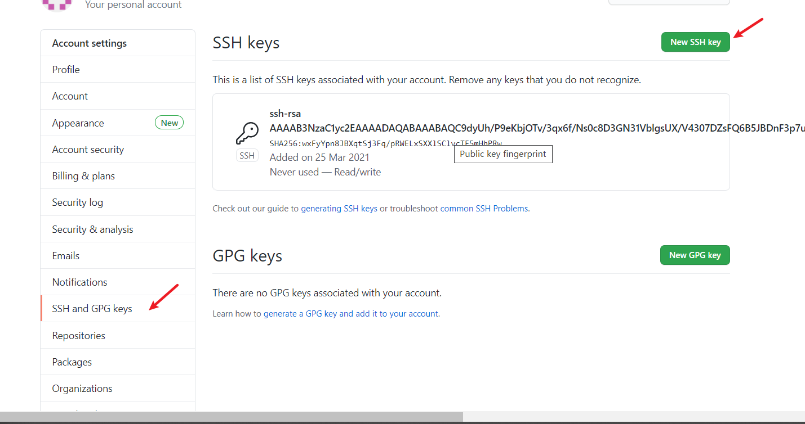
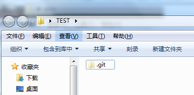
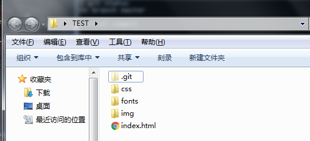
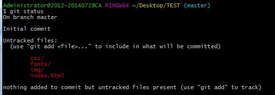
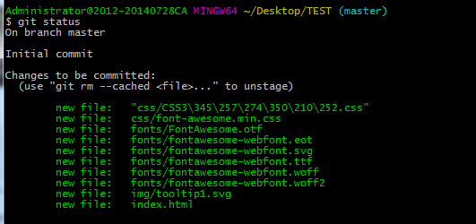
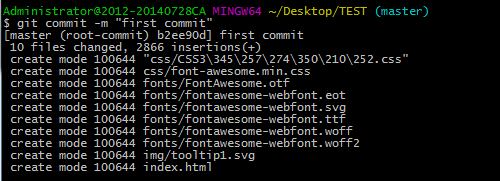
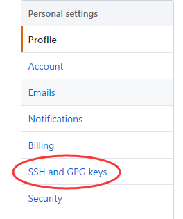
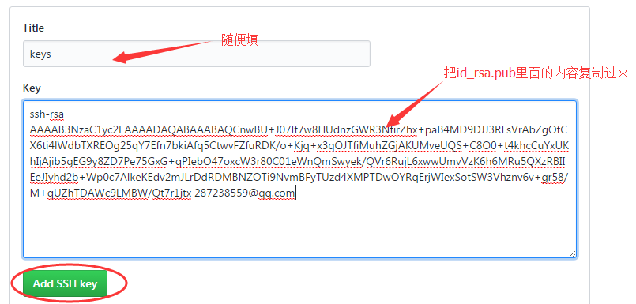
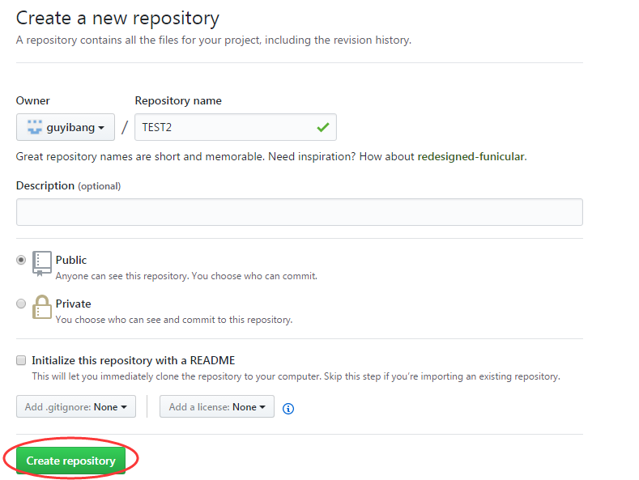

# git多账号提交适配（如果是一个账号请跳过）

我们知道本地提交代码首先要把本地的ssh key 输入到github账号里面，如果只是一个账号我们很好处理，那如果是两个账号呢？好，我们来理下步骤：

**思路：**本地电脑生成 两对密钥，分别用于两个github账号,将两对公钥输入到github网站上，然后用配置文件做映射每次提交仓库转换

##### 1).安装好Git客户端后，打开git bash，输入以下命令生成user1的SSH Key：


```css
ssh-keygen -t rsa -C "user1@qq.com"
```

在当前用户的.ssh目录下会生成id_rsa私钥文件和id_rsa.pub公钥文件，将id_rsa.pub中的内容添加至user1的github中。



**2)测试ssh key** 然后在git bash中输入以下命令测试该用户的SSH密钥是否生效：


```css
ssh -T git@github.com
```

若连接成功则提示Hi user1! You've successfully authenticated, but GitHub does not provide shell access.
 **注：该命令仅限于文件名为id_rsa的密钥。**

##### 3).打开git bash，输入以下命令生成user2的SSH Key：

进入~/.ssh路径下生成第二对密钥


```css
ssh-keygen -t rsa -C "user2@qq.com"
```

提示输入文件名时，可以自定义一个文件名以防止覆盖前面的（可以输入id_rsa_second）

注意此处网上大部分文章都没说是Windows 所以windows是需要更改下的

> 接着生成user2的密钥，注意不能再使用默认的文件名id_rsa，否则会覆盖之前密钥文件：
>
> **ssh-keygen -t rsa -f ~/.ssh/id_rsa2 -C "[user2@email.com](https://links.jianshu.com/go?to=mailto%3Auser2%40email.com)"**
>
> 再将该用户的公钥文件添加至github中。
>  测试user2的ssh连接时需要指定密钥文件
>
> **ssh -T [git@github.com](https://links.jianshu.com/go?to=mailto%3Agit%40github.com) -i ~/.ssh/id_rsa2**


```bash
错误：

按照ssh-keygen -t rsa -C "user2@qq.com" 生成rsa 但是本地已经有了所以会提示
Enter file in which to save  the key  输入文件的路径，如果这个时候~/.ssh/ xx_id_rsa   继续确认步骤最后就会出现 
Saving key  "~/.ssh/xx_id_rsa" failed : No such file or directory

解决：
Enter file in which to save  the key  输入文件的路径的时候用Windows的全路径   C:\Users\Administrator/.ssh/xx_id_rsa  这样就不会报错了。
```


**4) 测试user2 ssh**    再将该用户的公钥文件添加至github中,测试user2的ssh连接时需要指定密钥文件


```css
ssh -T git@github.com -i ~/.ssh/id_rsa2
```

也可以使用ssh agent添加密钥后进行测试。因为系统默认只读取id_rsa，为了让ssh识别新的私钥，可以使用ssh-agent手动添加私钥：


```csharp
ssh-agent bash
ssh-add ~/.ssh/id_rsa2
```

**注：该方法仅限当前窗口有效，打开新的窗口则ssh连接失败。**

**注意**：ssh agent  可能会出现 unable to start ssh-agent service, error :1058  如果执行出错不用管了 用上面的测试方法就可以

**5) 配置config文件**

在.ssh目录下创建一个config文本文件，每个账号配置一个Host节点。主要配置项说明：


```undefined
Host    　　主机别名
HostName　　服务器真实地址
IdentityFile　　私钥文件路径
PreferredAuthentications　　认证方式
User　　用户名
```

具体配置文件内容如下:


```css
# 配置user1 
Host user1.github.com
HostName github.com
IdentityFile C:\\Users\\Administrator\\.ssh\\user1_id_rsa
PreferredAuthentications publickey
User user1

# 配置user2
Host user2.github.com
HostName github.com
IdentityFile C:\\Users\\Administrator\\.ssh\\user2_id_rsa2
PreferredAuthentications publickey
User user2
```

再通过终端测试SSH Key是否生效


```ruby
ssh -T git@user1.github.com
ssh -T git@user2.github.com

注意点:
从github上新建仓库克隆仓库需要变化下,这点很重要 这也就是为什么要新建那个config文件的作用，其实就是一个映射关系

### 转换规则
# 原始clone 地址
#git@github.com:xx/user1Project.git
#git@github.com:xx/user1Project.git

# 新clone地址
#git@user1.github.com:xx/user1Project.git
#git@user2.github.com:xx/user1Project.git
```

**(6)配置用户名和邮箱**

如果之前配置过全局的用户名和邮箱，需要取消相关配置，再在各仓库下配置相应的用户名和邮箱。


```php
git config --global --unset user.name
git config --global --unset user.email
```

为各仓库单独配置用户名和邮箱


```css
git config user.name "user1"
git config user.email "user1@email.com"
```

如果原先使用HTTPS通信，使用sshkey 方式则需要修改远程仓库地址


```csharp
git remote rm origin
git remote add origin git@u1.github.com:xxx/xxxxx.git
```

# git 仓库创建提交

   Git的安装就不说了。

       第一步：我们需要先创建一个本地的版本库（其实也就是一个文件夹）。
    
       你可以直接右击新建文件夹，也可以右击打开Git bash命令行窗口通过命令来创建。
    
       现在我通过命令行在桌面新建一个TEST文件夹（你也可以在其他任何地方创建这个文件夹），并且进入这个文件夹


​                                          


       第二步：通过命令git init把这个文件夹变成Git可管理的仓库


​       

       这时你会发现TEST里面多了个.git文件夹，它是Git用来跟踪和管理版本库的。如果你看不到，是因为它默认是隐藏文件，那你就需要设置一下让隐藏文件可见。


​       
​       第三步：这时候你就可以把你的项目粘贴到这个本地Git仓库里面（粘贴后你可以通过git status来查看你当前的状态），然后通过git add把项目添加到仓库（或git add .把该目录下的所有文件添加到仓库，注意点是用空格隔开的）。在这个过程中你其实可以一直使用git status来查看你当前的状态。


​          

​    


       这里提示你虽然把项目粘贴过来了，但还没有add到Git仓库上，然后我们通过git add .把刚才复制过来的项目全部添加到仓库上。


​         

​    


        第四步：用git commit把项目提交到仓库。


​         

        -m后面引号里面是本次提交的注释内容，这个可以不写，但最好写上，不然会报错，详情自行Google。 好了，我们本地Git仓库这边的工作做完了，下面就到了连接远程仓库（也就是连接Github）
    
      由于本地Git仓库和Github仓库之间的传输是通过SSH加密的，所以连接时需要设置一下：
    
      第五步：创建SSH KEY。先看一下你C盘用户目录下有没有.ssh目录，有的话看下里面有没有id_rsa和id_rsa.pub这两个文件，有就跳到下一步，没有就通过下面命令创建


 **上面创建了这里就不需要创建了**

   $ ssh-keygen -t rsa -C "youremail@example.com"
        然后一路回车。这时你就会在用户下的.ssh目录里找到id_rsa和id_rsa.pub这两个文件   
        

      第六步：登录Github,找到右上角的图标，打开点进里面的Settings，再选中里面的SSH and GPG KEYS，点击右上角的New SSH key，然后Title里面随便填，再把刚才id_rsa.pub里面的内容复制到Title下面的Key内容框里面，最后点击Add SSH key，这样就完成了SSH Key的加密。具体步骤也可看下面：


​        



​    

  

​    第七步：在Github上创建一个Git仓库。

 你可以直接点New repository来创建，比如我创建了一个TEST2的仓库（因为我里面已经有了一个test的仓库，所以不能再创建TEST仓库）。

   

​    第八步：在Github上创建好Git仓库之后我们就可以和本地仓库进行关联了，根据创建好的Git仓库页面的提示，可以在本地TEST仓库的命令行输入：


注意 如果是多个账号就需要 修改git地址

git remote add origin    git@wwwguoguo520com.github.com:wwwguoguo520com/autoCommitGit.git

如果是单个账号直接执行

$ git remote add origin   git@github.com:wwwguoguo520com/autoCommitGit.git


​         

        注意origin后面加的是你Github上创建好的仓库的地址。
    
      第九步：关联好之后我们就可以把本地库的所有内容推送到远程仓库（也就是Github）上了，通过：

$ git push -u origin master
       由于新建的远程仓库是空的，所以要加上-u这个参数，等远程仓库里面有了内容之后，下次再从本地库上传内容的时候只需下面这样就可以了：
$ git push origin master
        上传项目的过程可能需要等一段时间，完成之后是这样的：

​        

        这时候你再重新刷新你的Github页面进入刚才新建的那个仓库里面就会发现项目已经成功上传了：


​      

        至此就完成了将本地项目上传到Github的整个过程。
    
      另外，这里有个坑需要注意一下，就是在上面第七步创建远程仓库的时候，如果你勾选了Initialize this repository with a README（就是创建仓库的时候自动给你创建一个README文件），那么到了第九步你将本地仓库内容推送到远程仓库的时候就会报一个failed to push some refs to  https://github.com/guyibang/TEST2.git的错。


​      

      这是由于你新创建的那个仓库里面的README文件不在本地仓库目录中，这时我们可以通过以下命令先将内容合并以下：

$ git pull --rebase origin master
        

       这时你再push就能成功了。


     总结：其实只需要进行下面几步就能把本地项目上传到Github
    
     1、在本地创建一个版本库（即文件夹），通过git init把它变成Git仓库；
    
     2、把项目复制到这个文件夹里面，再通过git add .把项目添加到仓库；
    
     3、再通过git commit -m "注释内容"把项目提交到仓库；
    
     4、在Github上设置好SSH密钥后，新建一个远程仓库，通过git remote add origin https://github.com/guyibang/TEST2.git将本地仓库和远程仓库进行关联；
    
     5、最后通过git push -u origin master把本地仓库的项目推送到远程仓库（也就是Github）上；（若新建远程仓库的时候自动创建了README文件会报错，解决办法看上面）。


      这里只是总结了Git上传项目的一些基本操作，要想更好地使用Git还需更进一步的学习。


​       

# git 自动同步脚本

这两天看了群里某个大佬的笔记，突然觉得自己用VSCode记笔记的方案不香了。VSCode虽然对`markdown`的支持不错，但毕竟本职工作不是这个，直接拿来做笔记还是不够方便，太笨重了。于是我终于想起之前同学给我安利的`markdown`编辑器：Typora。

## dalao的笔记

首先看看大佬的笔记：


好想去偷他的笔记。不过话说他这笔记软件也不错啊，看起来简约清晰，我也有试一试的想法了。

他用的笔记软件：https://github.com/tsujan/FeatherNotes

然后就被编译安装劝退了。一个是不太想这么折腾，另一个是这个软件没有提供编译好的包，感觉还是不够放心啊，毕竟如果以后开发者不维护了要再折腾一遍会非常麻烦。

## Typora，同学安利的markdown编辑工具

与多数markdown编辑工具不同，Typora是所见即所得的markdown编辑工具。为什么程序员偏爱markdown？就是因为markdown可以让我们写作的时候只关注内容本身，而不用太在意排版的问题。而Typora又改变了传统的左右分栏或者点击切换预览的传统markdown编辑模式，用起来就更舒服了。


### 安装

在Ubuntu下安装还是非常方便的：

```bash
# or run:
# sudo apt-key adv --keyserver keyserver.ubuntu.com --recv-keys BA300B7755AFCFAE
wget -qO - https://typora.io/linux/public-key.asc | sudo apt-key add -
# add Typora's repository
sudo add-apt-repository 'deb https://typora.io/linux ./'
sudo apt-get update
# install typora
sudo apt-get install typora
```

其他系统参考[官网](https://www.typora.net/#download)。

### 复制图片

不过有一点要注意：我们写文档常常要插入一些图片，为了后面和git好配合，我们需要将这些图片也放到当前文件夹里。按下`Ctrl+逗号`打开设置，将图片复制到当前文件夹下。如图。


### 重要的快捷键

都是重点等于没有重点。我们只要记住能让我们离开鼠标提高效率的就行了。

| 快捷键               | 功能           |
| -------------------- | -------------- |
| `Ctrl+S`             | 保存           |
| `Ctrl+Z`             | 撤销           |
| `Ctrl+Y`             | 重做           |
| `Ctrl+Shift+L`       | 侧边栏         |
| `Ctrl+/`             | 切换源代码模式 |
| 表格中，`Ctrl+Enter` | 添加一行       |

## 用git管理笔记

首先什么是git？有些少年区分不了git和github，这是姿势水平还不够啊。听说过GitLab没？听说过码云没？不是修福报的那个马云哦。

- git：当前最流行的分布式版本控制软件
- github：通过Git进行版本控制的软件源代码托管服务平台

鉴于本文并不是为了介绍这二者，本人就简单粗暴放个链接了。

https://zh.wikipedia.org/wiki/Git

https://zh.wikipedia.org/wiki/GitHub

git虽然大多用于管理程序源代码，但用来管理我们的笔记却也正好。虽然笔记对于版本控制的需求不是非常大，但聊胜于无嘛。最重要的是，你可以把笔记借助git同步到github上，什么时候换工作环境完全可以全pull下来，岂不美滋滋？

git版本库托管平台有很多，这里我并没有选择github，而是选择了[阿里云的Code平台](https://code.aliyun.com/)。毕竟在国内速度比较快啊。阿里云单个仓库容量足有2G，足够我们放笔记和笔记涉及的图片了。

怎么注册账号，怎么建立仓库我就不说了。clone下来，这就是以后笔记安家的地方了。

## 自动同步笔记

然而，我们还是需要运行`git add`、`git commit`、`git push`，而且在别处修改了笔记还得手动pull一下。执行的命令这么固定，肯定是要写成脚本(.sync.sh)了。

```bash
cd /home/zero/Documents/Notes
git pull &
typora . TODO.md
git add .
git commit -m "Sync"
git push
```

注意上面的路径改为你自己笔记文件夹的路径。第二行的`&`不要省，我们没必要等pull完才打开Typora，这样可以加快一点启动速度。

好了，现在我们执行脚本就能打开Typora，而且所有编辑还能自动同步。由于git默认不允许保留空提交，没有修改的时候也不会产生大量无用的记录，完美。

最后写个桌面启动器就大功告成了：

```ini
[Desktop Entry]
Type=Application
Icon=typora
Name=笔记
Exec=/home/zero/Documents/Notes/.sync.sh
Terminal=false
Hidden=false
```

`Note.desktop`文件名保存到桌面就成了。

## Windows下的配置

Git是跨平台的，Typora也是跨平台的，那么我们这个方案自然同样可以跨平台。

> Windows下的Typora并没有默认添加环境变量，请手动添加。添加后需要重启。

首先对应上面的sh，写个cmd(.sync.cmd)：

```cmd
start /b git pull
typora . TODO.md
git add .
git commit -m "Sync"
git push
```

第一行不一样，这是因为cmd后台执行是用`start /b`的，与shell脚本的`&`效果是一样的。

此时双击这个cmd已经能看到效果了。

但cmd执行时会有黑窗口，很影响美观，我们写个vbs脚本(.sync.vbs)来调用它，这样可以不显示黑窗口。

```vbs
WScript.CreateObject("WScript.Shell").Run ".sync.cmd",0
```

最后创建个桌面快捷方式，指向`.sync.vbs`，就大功告成了。

> 注意：快捷方式的起始目录要指向笔记的目录。

------

美中不足的是，在Android上我没找到比较合适的git客户端。虽然看到有个商用的评价不错，但为了这点笔记花那么多银子还是不值得。Android上的笔记软件倒是找到一个不错的：[Markor](https://github.com/gsantner/markor)。虽然没有Typora的所见即所得那么厉害，但他的编辑界面做的很不错，配上蓝牙键盘，非常适合某些科目上课做笔记。

> 转载 https://ntutn.top/archieved/old/Typora+git%E8%87%AA%E5%8A%A8%E5%90%8C%E6%AD%A5%E4%BD%A0%E7%9A%84%E7%AC%94%E8%AE%B0.html


追加 如果不想手动执行提交可以任务提交哦


# windows 定时任务提交git项目


打开“计划任务”，点击“任务计划程序库”，创建文件夹


在“常规”中，勾上“使用最高权限运行”，修改“配置”


点击“触发器”，设置“开始任务”，再进行“高级设置”


点击“操作”，设置“程序或脚本”和“添加参数”（2者都是bat的文件目录），设置“起始于”（为bat的根目录）


完成

### cmd 命令快速创建 任务

> schtasks /create /sc minute /mo 5 /tn "自动更新-git" /tr "D:\run.vbs"

**参数说明：**

schtasks /create：固定写法

/sc minute，/sc就指这条schtasks的类型。minute是分钟的意思，就是分钟类型，类型有很多，每小时每天每个月，具体的自己看文档。
/mo 5，/mo就是运行的频率，5就是每5分钟运行一次，假如/sc类型是hourly，就是每5个小时运行一次。
/tn "自动更新-git",/tn就是给这个计划任务取个名字。随意写
/tr "D:\XXXX.bat",/tr就是你要运行的路径，其实只要把创建的bat完整路径贴过来即可。


## 遇到问题解决：

### Windows里bat文件手动点击可以执行，但在计划任务里却无法执行？

### 


在起始于后边填上这个[bat文件](https://www.baidu.com/s?wd=bat文件&tn=SE_PcZhidaonwhc_ngpagmjz&rsv_dl=gh_pc_zhidao)所在的目录，

编辑任务把批处理文件的起始位置加上，如：在d:\aa.bat，那么起始位置就是：d:\ 

注：路径中不能有引号 。

如果是账户权限的问题，在常规里勾选上最高权限。


